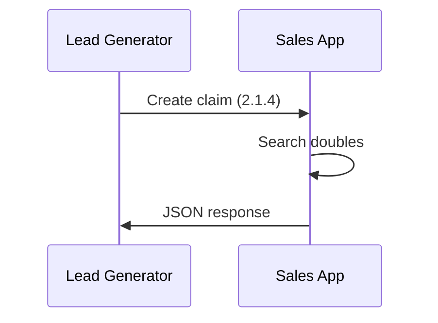

# API Documentation

Below is an example of documentation for API's method.

# [API-SAL-31] Managing claims

## 1.1 Create claim

Link to JIRA task

### 2.1.1. Method restriction

| № | Description                               | Reason                     |
|---|-------------------------------------------|----------------------------|
| 1 | Claim data must be valid                  | We don't need invalid data |
| 2 | No claims with the same mobile last month | Reduce call centre load    |

### 2.1.2. Business requirements

We need to ensure that claim was created by registered lead generator.

### 2.1.3. Algorithm

### 2.1.4. Create claim

| Interaction    | Lead Generator -> Sales App |
|----------------|-----------------------------|
| Interface      | Open API 3.0                |
| Method         | POST /api/v1/claims         |

**Request params**

| Field name | Required | Type   | Description               | Example      |
|------------|----------|--------|---------------------------|--------------|
| mobile     | yes      | string | Contact mobile            | +19125151588 |
| full_name  | yes      | string | Client's name in passport | Mike Smith   |

**Response params**

*Successful response*

| Field name    | Required | Type | Description         | Example |
|---------------|----------|------|---------------------|---------|
| success       | Yes      | bool | Was claim created?  | true    |
| data.claim_id | Yes      | int  | ID of created claim | 100500  |

*Response with error*

| Field name | Required | Type   | Description         | Example                                |
|------------|----------|--------|---------------------|----------------------------------------|
| success    | Yes      | bool   | Was claim created?  | true                                   |
| error      | Yes      | string | Error's description | Double claim was found for this mobile |
