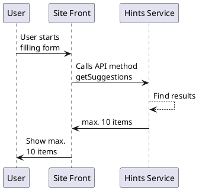

# PlantUML

[PlantUML](https://plantuml.com/) is a highly versatile tool that facilitates the rapid and straightforward creation of a wide array of diagrams.

See: [PlantUML Sandbox](https://www.plantuml.com/plantuml/uml)

## Sequence diagram

